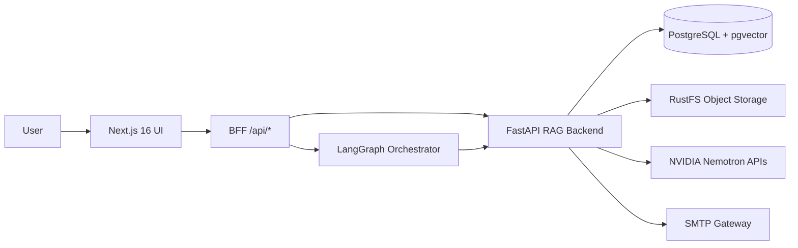
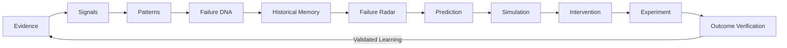
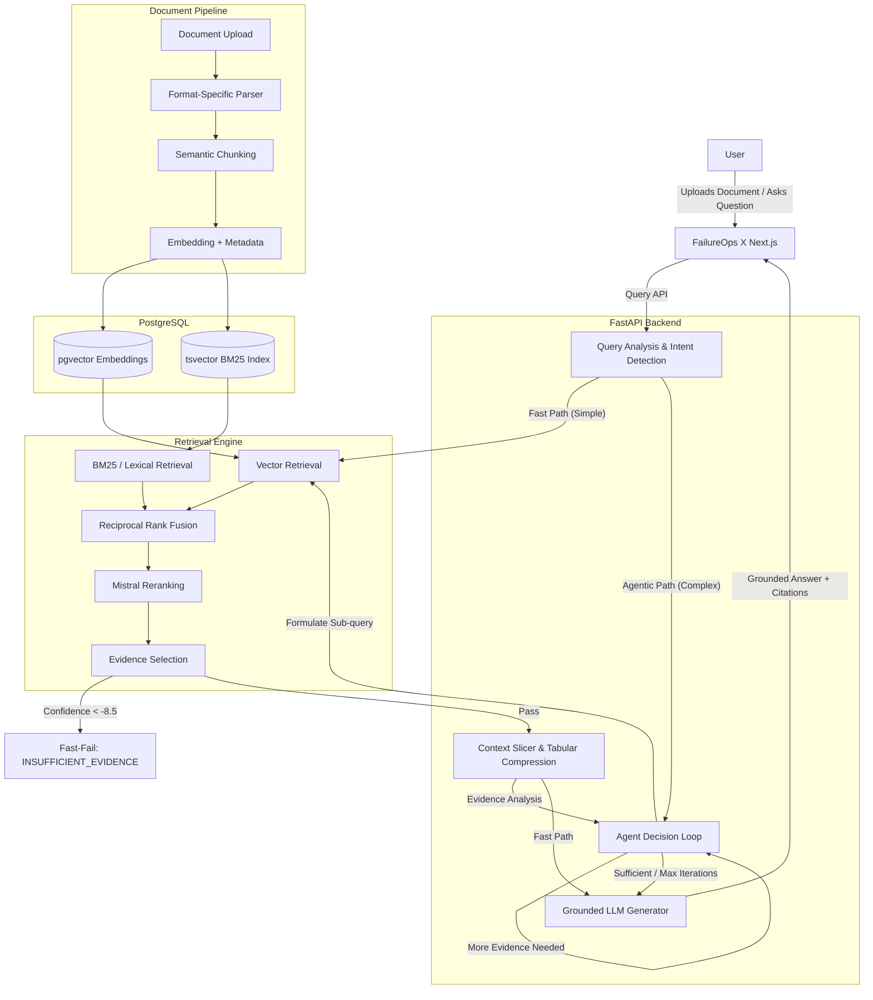

<p align="center">
  
</p>

<h1 align="center">FailureOps X</h1>

<p align="center">
  <strong>Autonomous Project Failure Intelligence Platform</strong><br/>
  Evidence-grounded early-warning system that ingests project documents, surfaces leading failure signals, and recommends interventions — before the postmortem.
</p>

<p align="center">
  <a href="https://failureops.shyxon.com/"><strong>Live App</strong></a>
  ·
  <a href="https://backendops.shyxon.com/docs"><strong>API Docs</strong></a>
  ·
  <a href="https://storage.shyxon.com/rustfs/console/"><strong>Object Storage</strong></a>
</p>

<p align="center">
  
  
  
  
  
  
  
</p>

---

## Table of Contents

- [What It Does](#what-it-does)
- [System Architecture](#system-architecture)
- [Intelligence Engines](#intelligence-engines)
- [RAG Pipeline](#rag-pipeline)
- [Multi-Format Document Ingestion](#multi-format-document-ingestion)
- [Retrieval Architecture](#retrieval-architecture)
- [LangGraph Orchestration](#langgraph-orchestration)
- [AI / ML Technology Stack](#ai--ml-technology-stack)
- [Frontend Pages & Features](#frontend-pages--features)
- [Backend API Reference](#backend-api-reference)
- [Database Architecture](#database-architecture)
- [Repository Structure](#repository-structure)
- [Local Setup](#local-setup)
- [Environment Variables](#environment-variables)
- [Production Deployment](#production-deployment)
- [Testing](#testing)
- [Troubleshooting](#troubleshooting)

---

## What It Does

Teams ship with fragmented artifacts: PRDs, support tickets, CI telemetry, customer feedback, sprint plans, incident reports. FailureOps X ingests these files into a **cited evidence graph**, then surfaces **operational signals** you can act on before it's too late.

| Stage | What You Get |
| --- | --- |
| **Ingest** | PDF, DOCX, PPTX, XLSX, CSV, Markdown, TXT, JSON → parsed, chunked, embedded into pgvector |
| **Retrieve** | Hybrid search (dense vectors + BM25 lexical), reranked, citation-backed grounded answers |
| **Evidence → Signal** | LangGraph orchestration: Upload → RAG phases → Evidence Agent → Signal Agent |
| **Intelligence** | Failure DNA profiling, radar trajectory, predicted failure points, intervention playbooks |
| **Action** | What-If simulations, experiment tracking, outcome verification, organizational memory |
| **Alert** | SMTP email dispatch: executive radar alerts, intelligence briefs, verification codes |

---

## System Architecture

```text
Browser
   │
   ▼
Next.js BFF (frontend/app/api/)   :3000     auth · rate limits · tenant context
                                          │
                                          ▼  HTTP
FastAPI     (langgraph-rag-main/) :8000     ingest · embed · retrieve · agents
   │
   ├── PostgreSQL 16 + pgvector            :5432     metadata + 2048-dim embeddings + BM25
   └── RustFS (S3-compatible)              :9000     original document storage
```



### Production Surfaces

| Surface | URL |
| --- | --- |
| Frontend | [failureops.shyxon.com](https://failureops.shyxon.com/) |
| Backend API | [backendops.shyxon.com](https://backendops.shyxon.com/) |
| OpenAPI Docs | [backendops.shyxon.com/docs](https://backendops.shyxon.com/docs) |
| Object Storage Console | [storage.shyxon.com/rustfs/console](https://storage.shyxon.com/rustfs/console/) |

---

## Intelligence Engines

FailureOps X is not a simple RAG chatbot. It runs **12 autonomous intelligence engines** that transform raw evidence into actionable failure intelligence:

| Engine | Module | Purpose |
| --- | --- | --- |
| **Evidence Agent** | `evidence_agent.py` | Extracts evidence items with provenance, confidence, and source citations |
| **Signal Agent** | `signal_agent.py` | Detects operational signals from evidence (defect trends, velocity drops, etc.) |
| **Failure DNA** | `dna_engine.py` | Profiles the project's dominant failure archetype across 8 dimensions |
| **Radar Engine** | `radar_engine.py` | Calculates failure risk trajectory and forecasts next failure point |
| **Simulation Engine** | `simulation_engine.py` | Runs what-if scenarios against different intervention strategies |
| **Experiment Engine** | `experiment_engine.py` | Tracks live experiments with hypothesis → outcome → verification |
| **Intervention Engine** | `intervention_engine.py` | Generates prioritized intervention playbooks with effort/impact scoring |
| **Outcome Engine** | `outcome_engine.py` | Verifies experiment outcomes and classifies success/regression |
| **Memory Engine** | `org_memory_engine.py` | Writes validated learnings into organizational memory for cross-project reuse |
| **Trend Detector** | `trend_detector.py` | Time-series analysis of engineering and product metrics |
| **Failure Chain** | `failure_chain_engine.py` | Maps causal failure chains and dependency relationships |
| **Relationship Detector** | `relationship_detector.py` | Discovers hidden correlations between evidence items |

### Continuous Organizational Reasoning Loop



---

## RAG Pipeline

The core document-grounded question-answering pipeline uses a rigorous multi-stage architecture:



### Pipeline Stages

| Stage | Input | Technology | Purpose |
| --- | --- | --- | --- |
| 1. Ingestion | Raw document bytes | FastAPI Background Tasks | Non-blocking async upload |
| 2. Parsing | Raw document | NVIDIA Nemotron Parse (PDF), python-docx, python-pptx, openpyxl, etc. | Structure-aware extraction |
| 3. Chunking | Structured blocks | Semantic chunker | Sentence-boundary-aware segmentation with overlap |
| 4. Embedding | Chunk text | `nvidia/llama-nemotron-embed-vl-1b-v2` | 2048-dim dense vectors |
| 5. Query Analysis | User query | Deterministic regex heuristics | Scope classification (SINGLE_FACT, EXHAUSTIVE_LIST, COMPARISON) |
| 6. Hybrid Retrieval | Query | pgvector + tsvector | Dense semantic + BM25 lexical search |
| 7. Fusion & Reranking | Candidate lists | RRF + `nvidia/llama-nemotron-rerank-vl-1b-v2` | Cross-encoder precision scoring |
| 8. Context Slicing | Ranked chunks | Deduplication + compression | Remove overlapping/irrelevant context |
| 9. Generation | Sliced context | `nvidia/nemotron-3-super-120b-a12b` | Grounded answer synthesis |
| 10. Citation Tracking | LLM output | Provenance mapper | Map evidence IDs → document pages/slides/sheets |

### Hallucination Prevention

1. **Semantic Fast-Fail Gate** — If all reranker scores < -8.5, short-circuit to `INSUFFICIENT_EVIDENCE` in <0.02s without invoking the generator LLM.
2. **Context Stripping** — Irrelevant chunks are actively removed from the prompt payload.
3. **Strict Grounding** — The LLM is prompted to refuse answers when evidence is insufficient.

---

## Multi-Format Document Ingestion

| Format | Parser | Extracted Content |
| --- | --- | --- |
| PDF | NVIDIA Nemotron Parse (VLM) | Text, tables, layout, page/block structure |
| DOCX | python-docx | Paragraphs, headings, tables |
| PPTX | python-pptx | Slides, text, titles, tables |
| XLSX | openpyxl | Worksheets, rows, tables |
| CSV | Python csv parser | Headers and rows |
| Markdown | Markdown parser | Headings, text, tables |
| TXT | Text parser | Paragraphs and logical sections |
| JSON | Python json parser | Structured/nested JSON parsing |

### Category-Based Evidence Upload

Documents are automatically classified into 6 evidence categories:

| Category | Example Files |
| --- | --- |
| `PRODUCT_PLAN` | product_roadmap.md, prd.pdf |
| `CUSTOMER_FEEDBACK` | feedback_survey.csv, nps_results.xlsx |
| `PRODUCT_METRICS` | activation_telemetry.csv, conversion_data.json |
| `ENGINEERING_METRICS` | ci_telemetry.csv, deploy_metrics.json |
| `TEAM_OPERATIONS` | ops_telemetry.csv, sprint_velocity.md |
| `INCIDENT_REPORTS` | postmortem_inc_402.md, sev1_report.pdf |

### Format-Aware Citations

| Format | Citation Unit |
| --- | --- |
| PDF | Page number |
| PPTX | Slide number |
| XLSX | Sheet name |
| CSV | Row range |
| DOCX | Section heading |
| Markdown | Section heading |
| TXT | Line/paragraph range |

---

## Retrieval Architecture

1. **Dense Vector Retrieval (pgvector)** — 2048-dimension embeddings with HNSW cosine similarity index. Captures semantic meaning (e.g., "holiday" → "vacation").
2. **BM25 Lexical Retrieval (tsvector)** — PostgreSQL full-text search for exact keyword matches (e.g., course codes, specific dates, metric names).
3. **Reciprocal Rank Fusion (RRF)** — Mathematical fusion `1 / (k + rank)` merges dense and lexical candidate lists.
4. **Cross-Encoder Reranking** — `nvidia/llama-nemotron-rerank-vl-1b-v2` assigns precise relevance logit scores per chunk.

### Agentic Multi-Hop Retrieval

For complex queries with multiple constraints, the system enters a bounded LLM-driven reasoning loop:
- Evaluates retrieved evidence for completeness
- Formulates targeted sub-queries for missing information
- Accumulates evidence across iterations (max 3)
- Handles exhaustive list queries with expanded `top_k = 300`

---

## LangGraph Orchestration

The frontend runs a **LangGraph** state machine that orchestrates the complete intelligence pipeline:

```text
LangGraph Flow
├── nodeUpload      → POST /api/v1/documents/upload (with project_id, category, source_type)
├── nodeParser      → Poll document status until COMPLETED
├── nodeChunker     → Verify chunk count > 0
├── nodeEmbedding   → Verify embedding count > 0
├── nodeVectorStore → Verify vector storage health
├── nodeSearch      → Execute hybrid retrieval test query
├── nodeEvidence    → Run Evidence Agent (extract evidence items)
└── nodeSignal      → Run Signal Agent (detect operational signals)
```

Each node reports progress to the UI with real-time status (RUNNING, COMPLETED, FAILED, WAITING).

---

## AI / ML Technology Stack

| Component | Technology / Model | Purpose |
| --- | --- | --- |
| Frontend UI | Next.js 16 + React 18 + TailwindCSS | App Router, server components, BFF proxy |
| Backend | FastAPI + SQLAlchemy + Pydantic | REST API, async workers, ORM |
| Database | PostgreSQL 16 + pgvector | Relational persistence + vector search + BM25 |
| Object Storage | RustFS (S3-compatible) | Original document persistence |
| PDF Parser | `nvidia/nemotron-parse` | Visual document understanding via VLM |
| Office Parsers | python-docx, python-pptx, openpyxl | Native Office structural parsing |
| Embedding Model | `nvidia/llama-nemotron-embed-vl-1b-v2` | 2048-dim dense vector generation |
| Reranker Model | `nvidia/llama-nemotron-rerank-vl-1b-v2` | Cross-encoder evidence ranking |
| Generator LLM | `nvidia/nemotron-3-super-120b-a12b` | Grounded answer synthesis |
| Orchestration | LangGraph (@langchain/langgraph) | Multi-node pipeline state machine |
| Email | SMTP (SSL/465) via smtp.nexudo.email | Alert dispatch, verification, briefs |
| CI/CD | GitHub Actions + rsync + PM2 | Zero-downtime continuous deployment |

---

## Frontend Pages & Features

### Public Pages

| Route | Page |
| --- | --- |
| `/` | Landing page |
| `/login` | Authentication |
| `/signup` | Registration |
| `/verify` | Email verification |
| `/forgot-password` | Password recovery |
| `/how-it-works` | Product explanation |
| `/platform` | Platform overview |

### Project Intelligence Pages

| Route | Page | Purpose |
| --- | --- | --- |
| `/projects/[id]/overview` | Project Overview | Risk score, signals, predictions, email brief |
| `/projects/[id]/upload` | Evidence Upload | Category-based document upload with LangGraph pipeline |
| `/projects/[id]/evidence` | Evidence Intelligence | Cited evidence items with "Open Source" document viewer |
| `/projects/[id]/ask` | Evidence Ask | Grounded Q&A against project documents |
| `/projects/[id]/signals` | Signal Explorer | Operational signal detection and severity tracking |
| `/projects/[id]/dna` | Failure DNA | 8-dimension failure archetype profiling |
| `/projects/[id]/radar` | Failure Radar | Risk trajectory and forecasted failure points |
| `/projects/[id]/causal` | Causal Analysis | Failure chain mapping and dependency graphs |
| `/projects/[id]/prediction` | Predicted Failure | Next failure forecast with confidence and horizon |
| `/projects/[id]/simulation` | What-If Simulation | Scenario modeling against intervention strategies |
| `/projects/[id]/experiment` | Experiments | Hypothesis tracking with outcome verification |
| `/projects/[id]/interventions` | Interventions | Prioritized playbooks with effort/impact scoring |
| `/projects/[id]/outcomes` | Outcome Verification | Experiment result classification (success/regression) |
| `/projects/[id]/truth-engine` | Truth Engine | Multi-constraint grounded investigation |
| `/projects/[id]/pipeline` | RAG Pipeline Health | Real-time document processing status |
| `/projects/[id]/analysis` | Run Analysis | Full intelligence analysis execution |

### Global Pages

| Route | Purpose |
| --- | --- |
| `/dashboard` | Organization-wide project dashboard |
| `/intelligence` | Cross-project intelligence view |
| `/memory` | Organizational memory and validated learnings |
| `/search` | Global evidence search |
| `/settings` | SMTP configuration and system settings |
| `/profile` | User profile management |
| `/security` | Security settings |

### Component Library

| Component Directory | Contents |
| --- | --- |
| `components/evidence/` | EvidenceDrawer, EvidenceList, citation cards with "Open Source" viewer |
| `components/radar/` | Radar trajectory charts and risk visualization |
| `components/causal/` | Causal graph rendering and failure chain visualization |
| `components/dna/` | Failure DNA spider charts and archetype cards |
| `components/intervention/` | Intervention playbook cards and priority scoring |
| `components/memory/` | Organizational memory timeline and learning cards |
| `components/pipeline/` | LangGraph pipeline progress and status nodes |
| `components/truth/` | Truth Engine investigation interface |
| `components/landing/` | Landing page sections and marketing components |
| `components/layout/` | Sidebar navigation, header, project layout shell |
| `components/profile/` | User profile and settings forms |
| `components/common/` | Shared UI primitives (badges, buttons, modals) |

---

## Backend API Reference

### Document Management

| Endpoint | Method | Purpose |
| --- | --- | --- |
| `/api/v1/documents/upload` | `POST` | Format-aware document ingestion (.pdf, .docx, .pptx, .xlsx, .csv, .md, .txt, .json) |
| `/api/v1/documents/` | `GET` | List all documents with processing status and chunk counts |
| `/api/v1/documents/{id}/download` | `GET` | Stream original file bytes with dynamic MIME type and tenant isolation |
| `/api/v1/documents/{id}` | `DELETE` | Cascade deletion across chunks, embeddings, and storage |

### Project Intelligence

| Endpoint | Method | Purpose |
| --- | --- | --- |
| `/api/v1/projects/{id}/upload` | `POST` | Project-scoped document upload with category classification |
| `/api/v1/projects/{id}/documents` | `GET` | List project documents with tenant filtering |
| `/api/v1/projects/{id}/documents/{docId}/download` | `GET` | Download project document with access control |
| `/api/v1/projects/{id}/ask` | `POST` | Grounded Q&A with hybrid retrieval and citations |
| `/api/v1/projects/{id}/evidence` | `GET` | Extract evidence items with provenance |
| `/api/v1/projects/{id}/signals` | `GET` | Detect operational signals from evidence |
| `/api/v1/projects/{id}/analysis` | `POST` | Run full intelligence analysis pipeline |
| `/api/v1/projects/{id}/dna` | `GET` | Failure DNA profiling |
| `/api/v1/projects/{id}/radar` | `GET` | Failure radar trajectory |
| `/api/v1/projects/{id}/predictions` | `GET` | Predicted next failure point |
| `/api/v1/projects/{id}/interventions` | `GET` | Intervention playbook recommendations |
| `/api/v1/projects/{id}/simulations` | `POST` | Run what-if simulation scenarios |
| `/api/v1/projects/{id}/experiments` | `GET/POST` | Experiment lifecycle management |
| `/api/v1/projects/{id}/outcomes` | `GET/POST` | Outcome verification and classification |

### Email & Notifications

| Endpoint | Method | Purpose |
| --- | --- | --- |
| `/api/email/status` | `GET` | SMTP connection status |
| `/api/email/test` | `POST` | Dispatch test verification email |
| `/api/email/send-alert` | `POST` | Dispatch Sev-1 radar alert email |
| `/api/email/share-report` | `POST` | Share executive intelligence brief |

### System Health

| Endpoint | Method | Purpose |
| --- | --- | --- |
| `/api/v1/health` | `GET` | API health check |
| `/api/v1/health/db` | `GET` | Database connectivity and pgvector status |

---

## Database Architecture

**PostgreSQL 16** with the **`pgvector`** extension for hybrid semantic + lexical search.

### Core Tables

| Table | Purpose |
| --- | --- |
| `documents` | Document metadata, status, file paths, project/org association |
| `pages` | Parsed page/slide/sheet records with block structure |
| `chunks` | Document chunks with content, lineage (JSONB), headers (JSONB), and `vector(2048)` embeddings |
| `projects` | Project registration with metadata and configuration |
| `project_analyses` | Analysis run history and results |
| `evidence_items` | Extracted evidence with source provenance and confidence |
| `signal_items` | Detected operational signals with severity and trend |
| `conversations` | Chat history for grounded Q&A sessions |

### Key Indexes

- **`embedding`** — HNSW index on `vector(2048)` column for fast cosine similarity search
- **`content_tsvector`** — GIN index on `tsvector` column for BM25 lexical matching
- **`document_id`** — B-tree indexes for foreign key lookups
- **`organization_id` + `project_id`** — Composite indexes for multi-tenant isolation

### Multi-Tenant Isolation

All queries enforce `organization_id` filtering. Private documents are protected with tenant verification — cross-organization access returns HTTP 403.

---

## Repository Structure

```text
FailureOps X/
├── frontend/                          Next.js 16 App Router (UI + BFF)
│   ├── app/
│   │   ├── api/                       21 BFF route handler directories
│   │   │   ├── analysis/              Analysis proxy
│   │   │   ├── ask/                   Grounded Q&A proxy
│   │   │   ├── auth/                  Authentication (login, signup, verify, etc.)
│   │   │   ├── documents/             Document management + download streaming
│   │   │   ├── email/                 SMTP alert and brief dispatch
│   │   │   ├── evidence/              Evidence retrieval proxy
│   │   │   ├── langgraph/             LangGraph run orchestration
│   │   │   ├── signals/               Signal detection proxy
│   │   │   └── ...                    (+ dna, experiments, health, interventions, etc.)
│   │   ├── projects/[id]/             16 project intelligence sub-pages
│   │   ├── dashboard/                 Organization dashboard
│   │   └── ...                        (login, signup, verify, settings, etc.)
│   ├── components/                    12 component directories
│   ├── lib/
│   │   ├── api/                       API client (apiClient singleton)
│   │   ├── langgraph/                 LangGraph graph definition and nodes
│   │   ├── server/                    Auth, authorization, rate-limit, config, RAG proxy
│   │   └── validation/                Input validation schemas
│   ├── context/                       React context providers
│   ├── hooks/                         Custom React hooks
│   ├── types/                         TypeScript type definitions
│   └── services/                      Service layer abstractions
│
├── rag/                               FastAPI RAG + Intelligence Backend
│   ├── app/
│   │   ├── api/                       REST endpoints (analysis, documents, chat, email, health)
│   │   ├── services/                  45 service modules (agents, engines, parsers, retrievers)
│   │   ├── models/                    SQLAlchemy ORM models (document, chunk, project, evidence, signal)
│   │   ├── core/                      Config, object storage, logging
│   │   ├── db/                        Database engine, session management, migrations
│   │   ├── embeddings/                Embedding service integration
│   │   ├── chunking/                  Semantic chunking pipeline
│   │   ├── parsing/                   Document parsing orchestration
│   │   ├── retrieval/                 Hybrid retrieval engine
│   │   ├── reranking/                 Cross-encoder reranking
│   │   ├── intelligence/              Intelligence engine orchestration
│   │   ├── privacy/                   Multi-tenant isolation
│   │   └── citations/                 Source provenance tracking
│   ├── tests/                         26 test files (unit + integration + eval)
│   ├── storage/                       Local document storage (dev fallback)
│   ├── docker/                        PostgreSQL init scripts
│   ├── docker-compose.yml             PostgreSQL + pgvector + RustFS + RAG
│   └── requirements.txt               Python dependencies
│
├── langgraph-rag-main/                Synced RAG mirror for LangGraph compatibility
│
├── database/                          Schema, migrations, demo seeds
│   ├── schema/                        SQL schema definitions
│   ├── migrations/                    Database migration scripts
│   └── seeds/                         Demo data seeding
│
├── shared/                            Cross-layer contracts
│   ├── constants/                     Shared constant definitions
│   ├── contracts/                     API contract interfaces
│   ├── schemas/                       Shared validation schemas
│   └── types/                         Shared type definitions
│
├── data/                              Mock data and sample projects
│   ├── demo/                          Demo project data
│   ├── sample_projects/               Sample project configurations
│   └── sanitized_cases/               Anonymized historical failure cases
│
├── docs/                              Architecture and agent specifications
├── tests/                             Foundation integration tests
├── .github/workflows/deploy.yml       CI/CD: rsync to VPS + deploy.sh on push to main
├── docker-compose.yml                 Full-stack compose (includes rag/docker-compose.yml)
├── deploy.sh                          Production deployment script (venv, build, PM2 reload)
├── ecosystem.config.js                PM2 process manager configuration
└── .env.example                       Environment variable template
```

---

## Local Setup

### Prerequisites

- **Node.js 20+**
- **Python 3.11+**
- **Docker Desktop** (for PostgreSQL + pgvector + RustFS)

### 1. Start the Database & Object Storage

```bash
docker compose -f rag/docker-compose.yml up -d postgres rustfs
```

This starts:
- **PostgreSQL 16 + pgvector** on port `5432`
- **RustFS** (S3-compatible storage) on port `9000` (console on `9001`)

### 2. Start the Backend (`rag/`)

```bash
cp rag/.env.example rag/.env
# Edit rag/.env → add NVIDIA_API_KEY and related keys

cd rag
python3 -m venv .venv
source .venv/bin/activate        # Windows: .venv\Scripts\activate
pip install -r requirements.txt

# For local development with filesystem storage:
STORAGE_PROVIDER=local uvicorn app.main:app --host 127.0.0.1 --port 8000 --reload

# For local development matching production (RustFS):
uvicorn app.main:app --host 127.0.0.1 --port 8000 --reload
```

### 3. Start the Frontend (`frontend/`)

```bash
cp .env.example frontend/.env
# Ensure BACKEND_INTERNAL_URL=http://127.0.0.1:8000

cd frontend
npm install
npm run dev                      # → http://localhost:3000
```

### Health Checks

| Check | URL |
| --- | --- |
| API Health | http://localhost:8000/api/v1/health |
| Database | http://localhost:8000/api/v1/health/db |
| Frontend Debug | http://localhost:3000/debug |
| RustFS Console | http://localhost:9001 |

---

## Environment Variables

> **Never commit `.env` files. Never prefix secrets with `NEXT_PUBLIC_`.**

Copy `.env.example` to `.env` in the appropriate directories.

### Frontend (Next.js BFF)

| Variable | Purpose |
| --- | --- |
| `BACKEND_INTERNAL_URL` | FastAPI origin the BFF proxies to (`http://127.0.0.1:8000`) |
| `RAG_INTERNAL_URL` | Alias for backend URL |
| `AUTH_SECRET` | Session signing key (≥ 32 characters in production) |
| `SESSION_COOKIE_NAME` | Session cookie identifier |
| `RATE_LIMIT_GENERAL` | General API rate limit (req/min) |
| `RATE_LIMIT_SEARCH` | Search rate limit |
| `RATE_LIMIT_ANALYSIS` | Analysis rate limit |
| `RATE_LIMIT_UPLOAD` | Upload rate limit |

### Backend (FastAPI RAG)

| Variable | Purpose |
| --- | --- |
| `DATABASE_URL` | PostgreSQL connection string |
| `NVIDIA_API_KEY` | Primary NVIDIA API key |
| `NVIDIA_LLM_API_KEY` | LLM generation key |
| `NVIDIA_LLM_API_KEY_1` | Round-robin LLM key pool |
| `NVIDIA_EMBED_API_KEY` | Embedding model key |
| `NVIDIA_PARSE_API_KEY` | PDF parser key |
| `NVIDIA_RERANK_API_KEY` | Reranker model key |
| `STORAGE_PROVIDER` | `local` or `rustfs` |
| `RUSTFS_ENDPOINT` | RustFS S3 endpoint |
| `RUSTFS_ACCESS_KEY` | RustFS access credential |
| `RUSTFS_SECRET_KEY` | RustFS secret credential |
| `RUSTFS_BUCKET` | Document storage bucket name |

### SMTP Email

| Variable | Purpose |
| --- | --- |
| `SMTP_SERVER` | SMTP server hostname |
| `SMTP_PORT` | SMTP port (465 for SSL, 587 for STARTTLS) |
| `SMTP_USER` | SMTP authentication username |
| `SMTP_PASSWORD` | SMTP authentication password |
| `SMTP_FROM_EMAIL` | Sender email address |

---

## Production Deployment

Push to `main` triggers [`.github/workflows/deploy.yml`](.github/workflows/deploy.yml):

1. **rsync** repository to VPS (excluding `.git`, `node_modules`, `.venv`, `.env*`)
2. **deploy.sh** executes on VPS:
   - Updates Python virtualenv + dependencies
   - Verifies database tables exist (auto-creates if missing)
   - Runs `npm install` + `npm run build` for the frontend
   - Zero-downtime PM2 reload

```text
PM2 Process Manager
 ├── failureops-backend   rag/       uvicorn :8000 (2 workers)
 └── failureops-frontend  frontend/  npm start :3000
```

Nginx terminates TLS for `failureops.shyxon.com` and `backendops.shyxon.com`.

### Full Docker Compose (Alternative)

```bash
docker compose up -d
```

This starts all services: PostgreSQL + pgvector, RustFS, FastAPI RAG, and Next.js frontend.

---

## Testing

### Backend Test Suites

```bash
cd rag
source .venv/bin/activate

# Individual suites
PYTHONPATH=. python3 tests/test_email_service.py          # 3 tests — SMTP email dispatch
PYTHONPATH=. python3 tests/test_document_download.py       # 5 tests — Download + tenant isolation
PYTHONPATH=. python3 tests/test_category_upload.py         # 9 tests — Category upload pipeline
PYTHONPATH=. python3 tests/test_downstream_workflow.py     # 7 tests — Simulation, experiments, outcomes
PYTHONPATH=. python3 tests/test_evidence_ask.py            # 4 tests — Grounded Q&A retrieval
PYTHONPATH=. python3 tests/test_signal_engine.py           # Signal detection and severity
PYTHONPATH=. python3 tests/test_registration_privacy.py    # Multi-tenant privacy enforcement
PYTHONPATH=. python3 tests/test_tenant_isolation.py        # Cross-org isolation
PYTHONPATH=. python3 tests/test_citation_validator.py      # Source provenance validation
```

### Evaluation Suite (Requires NVIDIA API Keys)

```bash
PYTHONPATH=. python3 tests/eval_suite.py
```

Tests factual extraction, list compilation, date lookups, hallucination refusal, out-of-domain fast-fail, multi-format ingestion, and cross-document retrieval.

### Frontend Build Verification

```bash
cd frontend
npm run build    # TypeScript type-check + production bundle
```

### Performance Benchmarks

| Query Type | Latency | Context Size | Result |
| --- | --- | --- | --- |
| Exact Fact | ~10–13s | ~27,000 chars | SUPPORTED |
| Date Lookup | ~10.6s | ~29,000 chars | SUPPORTED |
| Exhaustive List | ~29s | ~74,000 chars | SUPPORTED |
| Out-of-Domain | <0.02s (Fast-Fail) | 0 | INSUFFICIENT_EVIDENCE |

---

## Troubleshooting

| Issue | Solution |
| --- | --- |
| `psycopg2.OperationalError` (Backend crash) | Docker container isn't running. Run `docker compose -f rag/docker-compose.yml up -d postgres` |
| Frontend pages fail to load evidence | Ensure uvicorn is running on `:8000` and `BACKEND_INTERNAL_URL` is set in frontend `.env` |
| `MODEL_TIMEOUT` or `429 Too Many Requests` | NVIDIA API rate limit. Add separate keys for `NVIDIA_API_KEY` and `NVIDIA_LLM_API_KEY_1` |
| Upload stays in `PENDING` | Check backend terminal for parsing logs. Ensure NVIDIA parse API key is configured |
| `EmailService has no attribute` | Ensure `rag/app/services/email_service.py` is synced with `langgraph-rag-main/` |
| Document download returns 404 | Verify `STORAGE_PROVIDER` matches where files were uploaded (`local` vs `rustfs`) |
| Cross-org document access returns 403 | Expected behavior — multi-tenant isolation is enforced |

---

<p align="center">
  <sub>Built by <a href="https://shyxon.com">Shyxon</a> · FailureOps X · Evidence-Grounded Early-Warning Intelligence</sub>
</p>
