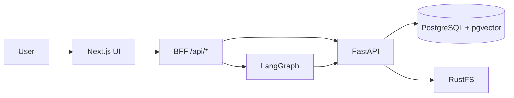

<p align="center">
  
</p>

<h1 align="center">FailureOps X</h1>

<p align="center">
  Organizational failure intelligence — ingest project documents, retrieve grounded evidence, and surface leading signals before the failure becomes a postmortem.
</p>

<p align="center">
  <a href="https://failureops.shyxon.com/"><strong>Live app</strong></a>
  ·
  <a href="https://backendops.shyxon.com/docs"><strong>API docs</strong></a>
  ·
  <a href="https://failureops.shyxon.com/projects/aurora/radar">Radar</a>
  ·
  <a href="https://failureops.shyxon.com/projects/aurora/interventions">Interventions</a>
</p>

<p align="center">
  
  
  
  
</p>

---

## What it does

Teams ship with fragmented artifacts: PRDs, support tickets, CI logs, customer notes, sprint plans. FailureOps turns those files into a **cited evidence graph**, then into **signals** you can act on.

| Stage | What you get |
| --- | --- |
| Ingest | PDF, DOCX, PPTX, XLSX, CSV, Markdown, TXT, JSON → parsed, chunked, embedded |
| Retrieve | Hybrid search (dense vectors + BM25), reranked, citation-backed answers |
| Evidence → Signal | LangGraph run: upload → RAG phases → Evidence agent → Signal agent |
| Intelligence | Failure DNA, radar trajectory, predicted failure points, interventions |

The browser never talks to Postgres. Next.js on `:3000` is a BFF. FastAPI on `:8000` is the only process that touches the database and object storage.

---

## Architecture

```text
Browser
   │
   ▼
Next.js 16  (frontend/)     :3000     UI + /api/* BFF
   │  HTTP only — no DATABASE_URL
   ▼
FastAPI     (rag/)          :8000     ingest · embed · retrieve · agents
   │
   ├── PostgreSQL 16 + pgvector        :5432     metadata + 2048-dim embeddings
   └── RustFS (S3-compatible)          :9000     original documents
```



Production:

| Surface | URL |
| --- | --- |
| Frontend | [failureops.shyxon.com](https://failureops.shyxon.com/) |
| Backend | [backendops.shyxon.com](https://backendops.shyxon.com/) |
| OpenAPI | [backendops.shyxon.com/docs](https://backendops.shyxon.com/docs) |
| Object storage console | [storage.shyxon.com/rustfs/console](https://storage.shyxon.com/rustfs/console/) |

---

## Repository layout

```text
frontend/          Next.js App Router UI and BFF routes
rag/               FastAPI RAG + intelligence agents
database/          Schema, migrations, demo seeds
docs/              Architecture and agent specs
shared/            Cross-layer contracts
tests/             Foundation ingest/retrieval checks
.github/workflows  Deploy to the production VPS on push to main
```

---

## Local setup

You need **Node 20+**, **Python 3.11+**, and **Docker** (for Postgres + pgvector).

### 1. Database

```bash
docker compose -f rag/docker-compose.yml up -d postgres
```

### 2. Backend (`rag/`)

```bash
cp rag/.env.example rag/.env   # add NVIDIA_API_KEY (and related keys)
cd rag
python3 -m venv .venv
source .venv/bin/activate      # Windows: .venv\Scripts\activate
pip install -r requirements.txt
STORAGE_PROVIDER=local uvicorn app.main:app --host 127.0.0.1 --port 8000
```

For local object storage that matches production, leave `STORAGE_PROVIDER=rustfs` and start the compose `rustfs` service as well.

### 3. Frontend (`frontend/`)

```bash
cp frontend/.env.example frontend/.env
# BACKEND_INTERNAL_URL=http://127.0.0.1:8000
npm --prefix frontend install
npm run dev                          # from repo root → frontend on :3000
```

### Health

| Check | URL |
| --- | --- |
| API | http://localhost:8000/health |
| Database | http://localhost:8000/health/db |
| Frontend debug | http://localhost:3000/debug |

### Foundation test

With both services running:

```bash
python3 tests/generate_aurora_docs.py
cd rag && source .venv/bin/activate && cd ..
pytest tests/test_foundation.py -q
```

---

## Environment

Copy the examples. **Never commit `.env` files. Never prefix secrets with `NEXT_PUBLIC_`.**

| Variable | Where | Purpose |
| --- | --- | --- |
| `BACKEND_INTERNAL_URL` | frontend | FastAPI origin the BFF proxies to |
| `DATABASE_URL` | rag only | Postgres. Not used by Next.js |
| `NVIDIA_API_KEY` | rag | Embeddings, parse, rerank, LLM |
| `STORAGE_PROVIDER` | rag | `local` or `rustfs` |
| `RUSTFS_*` | rag | S3-compatible original-file storage |
| `AUTH_SECRET` | frontend | Session signing (≥ 32 characters in production) |

---

## Production deploy

Push to `main` triggers [`.github/workflows/deploy.yml`](.github/workflows/deploy.yml): rsync to the VPS, then `deploy.sh` (venv, `npm run build`, PM2 reload).

```text
PM2
 ├── failureops-backend   rag/     uvicorn :8000
 └── failureops-frontend  frontend npm start :3000
```

Nginx terminates TLS for `failureops.shyxon.com` and `backendops.shyxon.com`.

---

## Further reading

- [System architecture](docs/ARCHITECTURE.md)
- [Agent contracts](docs/AGENTS.md)
- [Database](database/README.md)
- [FAILUREOPS_X_IMPLEMENTATION.md](FAILUREOPS_X_IMPLEMENTATION.md) — product and UI specification
