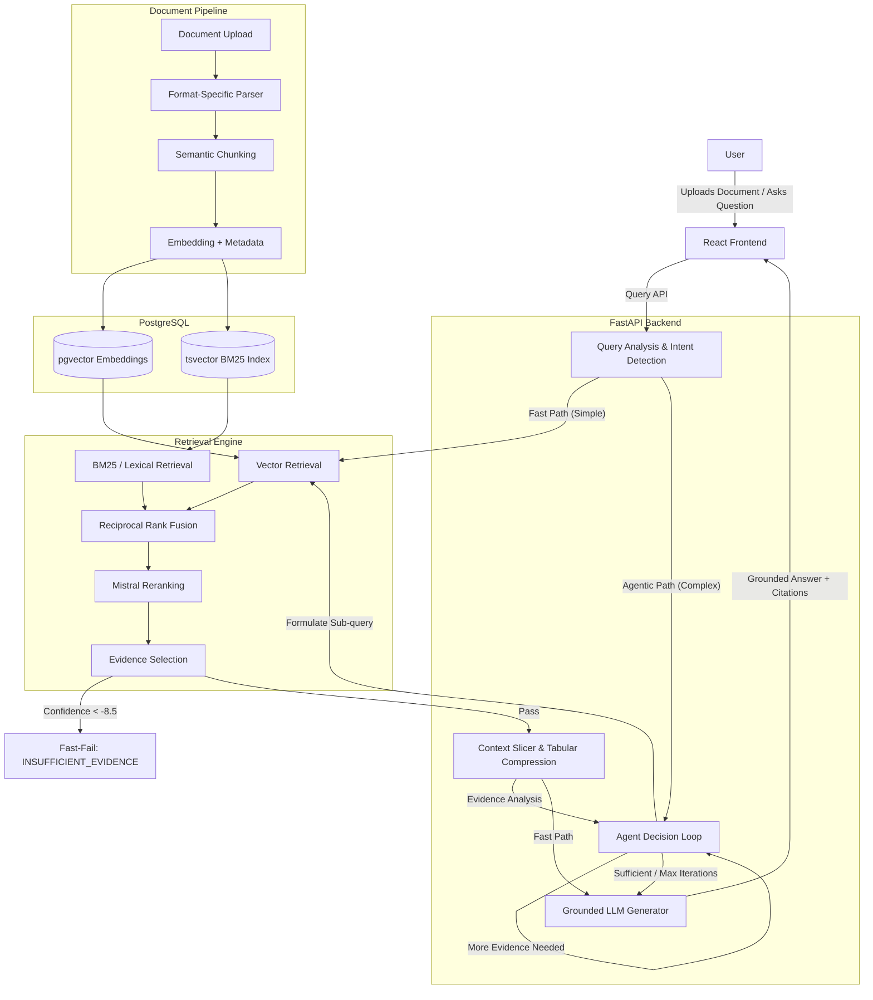

# 🚀 College Agentic RAG


An intelligent, production-grade document-grounded question-answering system. It visually parses complex multi-column documents (PDFs, DOCX, PPTX, etc.) and tables, retrieves exact evidence using hybrid strategies (Dense Vector + BM25 Lexical), reranks results for absolute precision, constructs tightly bounded evidence contexts, and generates citation-backed answers—while strictly refusing unsupported questions. Designed with a heavily optimized deterministic fast-path for NotebookLM-style latency.

---

## 📑 Table of Contents

- [🎯 Project Overview](#-project-overview)
- [✨ Key Features](#-key-features)
- [🏗️ High-Level Architecture](#️-high-level-architecture)
- [🔬 Detailed RAG Pipeline](#-detailed-rag-pipeline)
- [🔎 Retrieval Architecture](#-retrieval-architecture)
- [🧠 Query Processing](#-query-processing)
- [🛡️ Hallucination Prevention & Grounding](#️-hallucination-prevention--grounding)
- [⚡ Agentic RAG & Performance Architecture](#-agentic-rag--performance-architecture)
- [🤖 Agentic RAG Capabilities](#-agentic-rag-capabilities)
- [📈 Performance Benchmarks](#-performance-benchmarks)
- [🤖 AI / ML Technology Stack](#-ai--ml-technology-stack)
- [🖥️ Frontend](#️-frontend)
- [🔌 Backend API](#-backend-api)
- [🗄️ Database Architecture](#️-database-architecture)
- [📁 Project Structure](#-project-structure)
- [🛠️ Setup & Installation](#️-setup--installation)
- [⚠️ Troubleshooting](#️-troubleshooting)
- [🔮 Future Work](#-future-work)

---

## 🎯 Project Overview

**The Problem:** Normal PDF search engines and basic RAG pipelines often fail when confronted with real-world academic handbooks, university regulations, and campus calendars. They mangle multi-column text, completely scramble tabular data into unreadable chunks, and aggressively hallucinate facts when a semantic search accidentally pulls in unrelated but similar-sounding paragraphs.

**The Solution:** **College Agentic RAG** solves this through a rigorous, multi-stage pipeline:
1. **Intelligent Processing:** It uses Vision-Language Models (VLMs) to physically parse the structure of the document (keeping tables intact).
2. **Hybrid Retrieval:** It doesn't rely solely on dense vectors; it uses PostgreSQL Full-Text Search (BM25) to catch exact course codes and dates.
3. **Precision Reranking:** It mathematically fuses results (RRF) and scores them with a cross-encoder to guarantee precision.
4. **Grounded Generation:** It dynamically bounds the context size and generates an answer strictly tied to verifiable document citations.

*Complex Documents → intelligent document processing → hybrid retrieval → reranking → evidence selection → grounded generation → citation-backed answer*

---

## ✨ Key Features

### 📄 Document Intelligence
- **VLM PDF Parsing:** Physically understands PDF document layouts (paragraphs, headers, multi-column text) using NVIDIA Nemotron Parse. Other formats utilize native structural parsers.
- **Table Extraction:** Markdown-aware extraction ensures rows and columns are preserved accurately, preventing scrambled context.
- **Document Lineage:** Tracks the exact physical `page_id` and `block_id` (or format equivalent) for every parsed element.

### 🧩 Document Processing
- **Semantic Chunking:** Text is intelligently divided while respecting sentence and paragraph boundaries to maximize embedding quality.
- **Metadata Propagation:** Chunks natively inherit the title and section headers to provide semantic context during isolated retrieval.

### 🔎 Retrieval
- **Dense Vector Retrieval (pgvector):** Captures semantic meaning and concepts (e.g., matching "holiday" to "vacation").
- **BM25 Lexical Retrieval:** Uses PostgreSQL's `tsvector` to capture exact keyword matches (e.g., exact dates, specific course codes).
- **Reciprocal Rank Fusion (RRF):** Merges Dense and Lexical results to leverage the strengths of both algorithms.
- **Mistral 4B Reranking:** Re-scores the top fused candidates to guarantee absolute evidence precision.

### 🧠 Query Intelligence
- **Deterministic Scope Classification:** Uses regex heuristics to classify if a query is a `SINGLE_FACT`, `EXHAUSTIVE_LIST`, or `COMPARISON`.
- **Dynamic Context Bounds:** Retrieves 40 chunks for a list extraction, but only 20 chunks for a single fact.

### 🛡️ Grounded Generation & Hallucination Prevention
- **Semantic Fast-Fail:** If no chunk scores above the reranker threshold (`-8.5`), the system immediately short-circuits and refuses to answer without wasting time or tokens.
- **Strict Prompt Grounding:** The LLM is heavily prompted to rely *only* on the provided evidence.

### 📊 Observability & Citations
- **Source Tracking:** The frontend renders citation tags linked directly to specific filenames and logical page numbers.
- **Pipeline Visibility:** Displays domain classification state, execution iterations, and TTFT metrics directly in the UI.

### ⚡ Performance Optimization
- **Agentic Decision Making:** The system natively supports bounded multi-iteration evidence gathering for multi-hop questions, using an LLM to evaluate unresolved constraints before answering.
- **Context Slicing & Compression:** Deduplicates neighboring chunks and compresses overlapping tabular rows to prevent prompt bloat, ensuring clean evidence limits for large exhaustive lists.

---

## 🏗️ High-Level Architecture



---

## 📄 Multi-Format Document Ingestion V2

The system supports robust parsing and ingestion across multiple document formats:

| Format | Parser | Extracted Content |
|--------|--------|-------------------|
| PDF | Existing NVIDIA VLM parser | Text, tables, layout, page/block structure |
| DOCX | python-docx parser | Paragraphs, headings, tables |
| PPTX | python-pptx parser | Slides, text, titles, tables |
| XLSX | openpyxl parser | Worksheets, rows, tables |
| CSV | Python csv parser | Headers and rows |
| Markdown | Markdown parser | Headings, text, tables |
| TXT | Text parser | Paragraphs and logical sections |
| JSON | Python json parser | Structured/nested JSON parsing for RAG ingestion |

### Ingestion Architecture
The ingestion pipeline dynamically routes documents by file extension while ensuring all formats converge into the same robust RAG pipeline:

```text
Upload
  ↓
Format-specific parser
  ↓
Structured DocumentBlock/Page representation
  ↓
Existing chunking pipeline
  ↓
Embeddings + BM25
  ↓
Hybrid/RRF retrieval
  ↓
Reranking
  ↓
Agentic RAG generation
```

> **IMPORTANT:** The PDF pipeline continues to use the existing vision-language model (VLM) parser and was strictly preserved. Non-PDF formats are parsed natively and mapped directly into the existing chunking architecture. All non-PDF formats converge into the same existing RAG pipeline after parsing.

### Format-Aware Citations
Source lineage securely preserves format-specific structural metadata. The LLM sees structured source paths, and the frontend dynamically renders citations appropriately:

- **PDF** → Page
- **PPTX** → Slide
- **XLSX** → Sheet
- **CSV** → Rows
- **Markdown** → Section
- **DOCX** → Section
- **TXT** → logical text/line information

*Example Frontend Citations:*
```text
COLLEGE_DATA.PPTX
Slide 3

COLLEGE_DATA.XLSX
Sheet: Admissions
```

### Smart Source & Preview Behavior
Clicking a document source citation is dynamically format-aware:

- **PDF** → Continues to seamlessly open the existing browser PDF viewer.
- **DOCX / PPTX / XLSX** → Safely triggers an original file download (no brittle PDF conversions).
- **CSV / MD / TXT** → Served inline for instant browser-native reading where supported.

---

## 🔬 Detailed RAG Pipeline

### 1. Document Ingestion
- **Input:** Raw document bytes (.pdf, .docx, .pptx, .xlsx, .csv, .md, .txt, .json).
- **Technology:** FastAPI Background Tasks.
- **Why:** Non-blocking async ingestion allows the UI to stay responsive while heavy processing occurs.

### 2. Format-Aware Parsing
- **Input:** Raw document.
- **Processing:** Dynamically routes the file to its specific parser (e.g., VLM for PDFs, python-pptx for PPTX) to extract tables and text blocks.
- **Technology:** NVIDIA Nemotron Parse (PDFs), python-docx, python-pptx, openpyxl, etc.
- **Why:** Standard scrapers destroy tables. Specialized parsers and VLMs natively recognize structure.

### 3. Chunking & Metadata
- **Input:** Structured Markdown.
- **Processing:** Slices text into overlapping windows while attaching original `page_id` lineage and section headers.
- **Why:** LLMs have context limits; documents must be segmented into digestible, locatable pieces.

### 4. Embedding
- **Input:** Chunk text.
- **Processing:** Maps the text to a 1024-dimensional mathematical space.
- **Technology:** `nvidia/nemotron-3-embed-1b`
- **Why:** Allows for semantic similarity distance calculations.

### 5. Query Analysis
- **Input:** User query.
- **Processing:** Deterministic regex pattern matching.
- **Output:** Query scope (e.g., `EXHAUSTIVE_LIST`).
- **Why:** Controls the retrieval depth. A list of dates requires far more retrieval candidates than a simple lookup.

### 6. Hybrid Retrieval
- **Processing:** Parallels a `pgvector` HNSW search (Dense) and a PostgreSQL `tsvector` match (BM25 Lexical).
- **Why:** Vector search understands "academic break" = "holiday". BM25 understands that "MCT-204" must precisely match "MCT-204".

### 7. RRF & Reranking
- **Processing:** Fuses the two candidate lists (Reciprocal Rank Fusion), then uses a Cross-Encoder to evaluate the query against the chunk text.
- **Why:** Initial retrieval is rough. Rerankers are expensive but highly precise algorithms that ensure only true evidence makes the final cut.

### 8. Context Slicing
- **Processing:** Deduplicates retrieved chunks by unique ID and slices the final array.
- **Why:** Sending 50 overlapping chunks blows up the LLM context, wastes tokens, and causes TTFT timeouts. 

### 9. Grounded Generation
- **Processing:** Injects sliced context into the generative LLM prompt.
- **Why:** Synthesizes the final human-readable answer.

### 10. Citation Tracking
- **Output:** The LLM returns a structured JSON payload referencing specific Evidence IDs. The backend maps these back to original document metadata (pages, slides, sheets, etc.).
- **Why:** Prevents hallucinations and builds user trust.

---

## 🔎 Retrieval Architecture

Retrieval prioritizes raw document content using a **Hybrid Search** approach. 
1. **Dense Retrieval:** We store 1024-dimension vectors in PostgreSQL using the `pgvector` extension. Cosine similarity operations quickly find semantically similar chunks.
2. **Lexical Retrieval:** We utilize PostgreSQL's native `tsvector` and `plainto_tsquery` to execute BM25-style full-text search. This is critical for exact noun matches.
3. **Fusion (RRF):** We implement mathematical Reciprocal Rank Fusion (`1 / (k + rank)`) to merge the Dense and Lexical lists.
4. **Reranking:** The fused list is sent to a Mistral 4B Cross-Encoder, which returns a relevance logit score (e.g. `-2.5`, `-8.0`) for every chunk against the user query.

**Example:**
*Query: "When does the CSE 402 exam start?"*
- Dense Retrieval knows "exam" is similar to "test" or "midterm".
- Lexical Retrieval specifically matches the exact string "CSE 402".
- Reranking confirms which chunk actually answers "When".

---

## 🧠 Query Processing

The system does NOT use slow LLM calls to understand standard queries. It employs **Deterministic Heuristic Analysis**:
- The `query_understanding.py` module runs regex patterns over the query.
- If it detects words like "all", "every", "list", it flags the scope as `EXHAUSTIVE_LIST`.
- This adjusts the downstream retrieval engine to increase the `top_k` candidates and lowers the reranker threshold to maximize recall without sacrificing precision.

---

## 🛡️ Hallucination Prevention & Grounding

The system aggressively prevents unsupported answers.

1. **Semantic Fast-Fail Gate:**
   - If the Mistral Reranker scores all retrieved chunks terribly (a logit score `< -8.5`), the backend instantly realizes the query is Out-Of-Domain.
   - It short-circuits the pipeline and returns `INSUFFICIENT_EVIDENCE` in `<0.02s` without ever waking the 120B generator.
2. **Context Slicing:**
   - Irrelevant chunks (scoring `< -8.5`) are actively stripped from the context payload.
3. **Strict Grounding:**
   - The LLM is prompted to explicitly refuse to answer if the provided evidence array does not contain the answer.

*The system prefers saying "I don't have enough evidence" over inventing an answer.*

---

## ⚡ Agentic RAG & Performance Architecture

**Hybrid Agentic Architecture:** 
The system employs a bounded Agentic RAG architecture that routes queries dynamically based on complexity.
- **Fast Path:** Simple factual lookups bypass the iterative agent loop and flow deterministically from retrieval to generation, maximizing speed.
- **Agentic Loop:** For complex, multi-hop, or multi-constraint queries, the system enters a bounded LLM-driven reasoning loop. The agent evaluates retrieved evidence, identifies missing targets, and formulates new sub-queries to retrieve missing context until all constraints are satisfied or the maximum iteration limit is reached.

**Performance Optimizations:**
- **Tabular Deduplication:** Context overlapping across chunks is globally deduplicated at the exact-string row level.
- **Dynamic Slicing:** Factual queries strictly cap out at 4-5 chunks, while exhaustive list queries scale safely up to 150 compressed chunks.
- **API Key Round-Robin:** Automatic rotation across multiple NVIDIA LLM API keys natively handles rate-limits (`429 Too Many Requests`) via seamless retries.

---

## 🤖 Agentic RAG Capabilities

The system natively implements bounded agentic orchestration for complex queries, overcoming the limitations of standard single-pass RAG pipelines.

### 1. Agent Decision & Multi-hop Retrieval
For complex questions, the system leverages an LLM-driven next-action selection loop.
- **Process:** It retrieves initial evidence, accumulates it, and evaluates what information is still missing. 
- **Action:** If constraints are unresolved, the agent formulates a targeted sub-query, retrieves again, and combines the new evidence with the historical context.
- **Safety:** The multi-iteration reasoning is bounded by a maximum iteration limit (`max_iterations = 3`) to guarantee a response and prevent infinite loops.

### 2. Constraint-aware Queries
When a query contains multiple conditions (e.g., *"Which student registered for Computer Vision and was born on 22/08?"*), the query understanding engine identifies the constraints. The agent iteratively retrieves evidence until it can successfully intersect the constraints, discarding candidates that only satisfy a single condition.

### 3. Exhaustive / List Queries
Unlike traditional semantic RAG that retrieves only the top-K relevant passages, the system explicitly detects list-intent (e.g., *"Which students registered for Computer Vision?"*).
- **Broader Candidate Pool:** Vector and BM25 candidate caps are massively expanded (`top_k = 300`) to guarantee high recall.
- **Tabular Deduplication:** To prevent context explosion, the pipeline deterministically filters and globally deduplicates identical matching rows across all chunks.
- **Comprehensive Generation:** The LLM is explicitly instructed to output *all* verified entities rather than artificially truncating the list.

### 4. Fast Path
The system does not blindly force every query through the agentic loop. Simple factual lookups automatically bypass the LLM reasoning overhead entirely, flowing directly from retrieval to generation for maximum speed.

### 5. Multi-Key LLM API Management
To ensure production reliability and combat rate limits, the system implements a dynamic `LLMKeyManager`.
- **Round-Robin Rotation:** Automatically distributes inference loads across a dynamic pool of `.env` API keys (e.g., `NVIDIA_LLM_API_KEY_1`, `NVIDIA_LLM_API_KEY_2`, etc.).
- **Cooldowns & Retries:** If a `429 Too Many Requests` or timeout occurs, the manager temporarily places the specific key on cooldown and seamlessly retries the request using the next healthy key in the pool.

### 6. Frontend Progress Visibility
The React UI natively exposes the agent's internal state. The UI features an expandable observability block that tracks:
- Execution Iterations (e.g., `1 / 3`)
- LLM Stop Reason (e.g., `SUFFICIENT_EVIDENCE`, `MAX_ITERATIONS_PARTIAL`)
- Domain State & Evidence State
- Total and generation latencies

---

## 📈 Performance Benchmarks

*Measured on the project's internal evaluation suite against a live backend (`tests/eval_suite.py`). Note: Absolute model latency is highly dependent on upstream NVIDIA API network conditions.*

| Query Type | Previous Architecture Latency | Current Fast-Path Latency | Context Size (Chars) | Result |
|---|---:|---:|---:|---|
| **Exact Fact** | > 22.0s | **~10.0 - 13.0s** | ~27,000 | SUPPORTED |
| **Date Lookup** | > 18.0s | **~10.6s** | ~29,000 | SUPPORTED |
| **Exhaustive List** | > 29.0s | **~29.0s** | ~74,000 | SUPPORTED |
| **Out-of-Domain** | > 18.0s | **< 0.02s** (Fast-Fail) | 0 | INSUFFICIENT |

---

## 🤖 AI / ML Technology Stack

| Component | Technology / Model | Purpose |
|---|---|---|
| **Frontend Framework** | React / Vite | User Interface |
| **Backend Framework** | FastAPI | API Server |
| **Database** | PostgreSQL | Relational Persistence & BM25 |
| **Vector Search** | pgvector | Semantic Vector Retrieval |
| **PDF Parser** | `nvidia/nemotron-parse` | Visual Document Understanding |
| **DOCX/PPTX/XLSX Parsers** | `python-docx`, `python-pptx`, `openpyxl` | Native Office structural parsing |
| **TXT/CSV/MD/JSON Parsers** | Native Python | Fast text and tabular extraction |
| **Embedding Model** | `nvidia/llama-nemotron-embed-vl-1b-v2` | Dense Vector Generation |
| **Reranker Model** | `nvidia/llama-nemotron-rerank-vl-1b-v2` | Cross-Encoder Evidence Ranking |
| **Generation LLM** | `nvidia/nemotron-3-super-120b-a12b` | Synthesize Grounded Answers |

---

## 🖥️ Frontend

Built with **React, TypeScript, Vite, Tailwind CSS, and Lucide Icons**.

**Capabilities:**
- **File Upload:** Asynchronous multipart file upload with real-time UI polling (`PENDING`, `PROCESSING`, `COMPLETED`, `FAILED`).
- **Sidebar Management:** Persistent tracking of the uploaded document knowledge base with one-click deletion.
- **Chat Interface:** Distinct user/assistant message bubbling.
- **Markdown Rendering:** Natively supports bold, italics, code blocks, and markdown tables.
- **Citation Badges:** Assistant answers include explicitly grouped citation badges mapped to filenames and format-specific lineage (e.g., logical page numbers, slides, sheets, sections).
- **Pipeline Observability:** Includes an expandable debug block tracking Domain State, Execution Iterations, and Latency metrics.

---

## 🔌 Backend API

Built heavily on **FastAPI** leveraging async workers.

| Endpoint | Method | Purpose |
|----------|--------|---------|
| `/api/v1/documents/upload` | `POST` | Triggers format-aware ingestion of documents (.pdf, .docx, .pptx, .xlsx, .csv, .md, .txt, .json) |
| `/api/v1/documents/` | `GET` | Lists all documents, processing status, and chunk counts |
| `/api/v1/documents/{id}/download` | `GET` | Streams the original file bytes with dynamic MIME type |
| `/api/v1/documents/{id}` | `DELETE` | Cascades deletion across all chunks and vectors |
| `/api/v1/chat/` | `POST` | Core RAG endpoint (accepts query, returns grounded JSON) |

---

## 🗄️ Database Architecture

We use **PostgreSQL 15+** equipped with the **`pgvector`** extension.

**`documents` Table:**
- Tracks `id`, `filename`, `status`, and administrative metadata (e.g., `department`, `academic_year`).
- One-to-many relationship with `chunks` and `pages`.

**`chunks` Table:**
- `document_id` (FK)
- `content` (Text: the actual parsed document string)
- `lineage` (JSONB: stores array of `page_ids` and `block_ids` for precise tracing)
- `headers` (JSONB: contextual hierarchy extracted from the document)
- `embedding` (`vector(2048)`: pgvector column for cosine search)
- Standard PostgreSQL `tsvector` indexes cover the `content` column for lexical BM25 matching.

---

## 📁 Project Structure

```text
agentic_rag/
├── app/
│   ├── api/                 # FastAPI routes (chat, documents)
│   ├── core/                # ENV Configuration, logging
│   ├── db/                  # SQLAlchemy models and migrations
│   └── services/            # Retrieval, Chunking, Query Analysis, LLM bindings
│       ├── docx_parser.py
│       ├── pptx_parser.py
│       ├── xlsx_parser.py
│       ├── csv_parser.py
│       ├── markdown_parser.py
│       ├── txt_parser.py
│       └── json_parser.py
├── docker/                  # Docker Compose (PostgreSQL + pgvector)
├── docs/                    # Technical architecture notes
├── frontend/                # React / Vite SPA codebase
├── storage/                 # Local mounted file storage for documents
├── tests/                   # Headless evaluation suite
├── .env.example             # Configuration template
├── docker-compose.yml       # Infrastructure orchestration
├── requirements.txt         # Python backend dependencies
└── README.md                # Project Documentation
```

---

## 🛠️ Setup & Installation

### 1. Prerequisites
- **Python 3.10+**
- **Node.js 18+**
- **Docker Desktop** (Required to run the PostgreSQL database with the specialized AI `pgvector` extension)
- **Git**

### 2. Clone the Repository
```bash
git clone https://github.com/Princewinston/agentic-rag.git
cd agentic-rag
```

### 3. Start the Database (Docker)
This runs PostgreSQL + `pgvector` locally on port 5435.
```bash
docker-compose up -d
```

### 4. Backend Environment & Dependencies
```bash
# Create Virtual Env (Windows)
python -m venv .venv
.\.venv\Scripts\activate

# Install Dependencies
pip install -r requirements.txt
```

### 5. Environment Variables
```bash
copy .env.example .env
```
Open `.env` and configure:
- `NVIDIA_API_KEY`: Main key for AI Services (Embeddings, Reranking, Parsing).
- `NVIDIA_LLM_API_KEY_1`: Dedicated generation LLM key.
*(Do not commit `.env`!)*

### 6. Initialize Database
Create tables and vector indexes:
```bash
python -m app.db.init_db
```

### 7. Start Backend
```bash
python -m uvicorn app.main:app --host 127.0.0.1 --port 8000 --reload
```

### 8. Start Frontend (New Terminal)
```bash
cd frontend
npm install
npm run dev
```
Navigate to **`http://localhost:5173`** to access the application!

---

## 🧪 Evaluation

The repository includes a headless evaluation framework to test factual retrieval, multi-fact iterative reasoning, and proper refusal thresholds deterministically without UI overhead.

**Run the suite:**
```bash
$env:PYTHONUNBUFFERED=1; python tests/eval_suite.py
```

**What it tests:**
- Factual extraction queries
- Exhaustive list compilation
- Date lookups
- Strict refusal for missing evidence (Hallucination prevention)
- Out-of-domain fast-fail latency
- Multi-format ingestion (.docx, .pptx, .xlsx, .csv, .md, .txt, .json) and structural integrity
- Cross-document retrieval across different file formats
- Document deletion cascade isolation for non-PDF deleted formats
- Existing PDF RAG behavior intact (Regression tests passed)

---

## ⚠️ Troubleshooting

- **`psycopg2.OperationalError` (Backend Crash):** Your Docker container isn't running. Open Docker Desktop and ensure `docker-compose up -d` was executed.
- **Frontend says `Failed to fetch`:** The React frontend cannot reach the FastAPI backend. Ensure the backend is actively running on port 8000.
- **`MODEL_TIMEOUT` or `429 Too Many Requests`:** The NVIDIA API is rate-limiting you. Ensure you have configured separate keys for `NVIDIA_API_KEY` and `NVIDIA_LLM_API_KEY_1` in `.env`.
- **Upload stays in `PENDING`:** Ensure the backend worker is not frozen and check the backend terminal for parsing logs.

---

## 🔮 Future Work

### Implemented
- Hybrid Search (Vector + BM25)
- Cross-Encoder Reranking
- Out-of-Domain Fast-Fail
- Context Deduplication Slicing

### Future Enhancements
- **GraphRAG Support:** Extract local knowledge graphs from documents for deeper multi-hop entity reasoning.
- **Web Search Integration:** Allow the system to dynamically break out to web searches when local document evidence is explicitly insufficient.
- **Streaming UI:** Implement Server-Sent Events (SSE) to stream generator output token-by-token to the React frontend to mask generation latency.
- **Document-Aware Chat Memory:** Expand the chat pipeline to store and rewrite conversational context against vector history.
