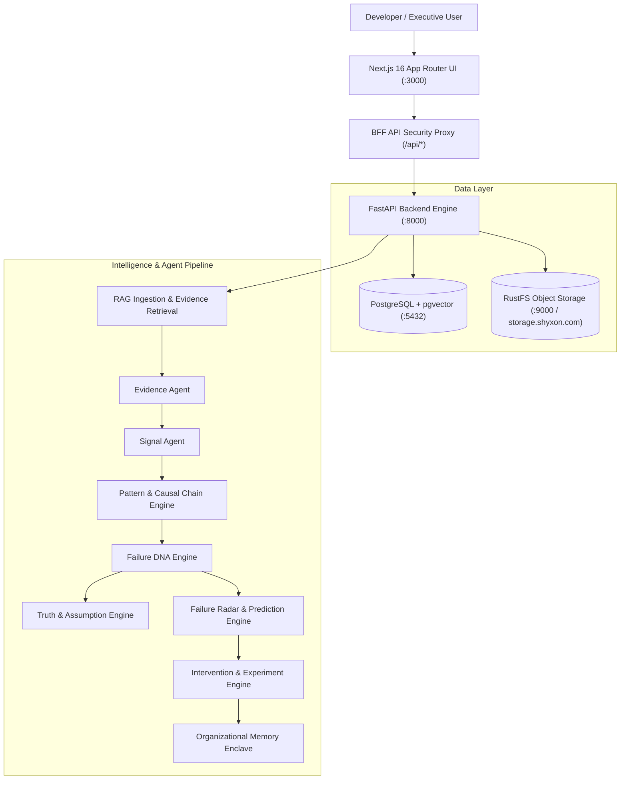

# FailureOps X — System Architecture & Layer Specifications

```
                                  FAILUREOPS X
               Organizational Failure Intelligence & Decision Enclave
```

## 1. High-Level System Architecture



---

## 2. Core Architectural Layers & Responsibilities

### Layer 1: Frontend & BFF Layer (`/app`, `/components`, `/context`)
- **Technology**: Next.js 16 (Turbopack), React 18, Tailwind CSS, Lucide Icons, Recharts.
- **Responsibilities**:
  - Zero-exposure BFF API routes (`/api/*`) proxying client requests with tenant cookie authentication.
  - Interactive Causal DAG, Failure DNA radar visualizers, radar trajectory charts, and assumption cross-examiners.
  - Lineage and snippet inspection drawers for citations.
  - **Constraint**: The frontend does NOT perform any AI calculations, raw scoring, or document vectorization.

### Layer 2: RAG & Evidence Ingestion Layer (`/rag/app/services`, `/rag/app/api`)
- **Technology**: Docling, PyMuPDF (PDF, DOCX, PPTX, XLSX, CSV, JSON, Markdown), NVIDIA Llama-Nemotron-Embed-VL-1B-v2 (2048-dim vectors), PostgreSQL `pgvector`, RustFS object storage.
- **Responsibilities**:
  - Secure multi-format document parsing and table/header preservation.
  - Semantic section-aware chunking with deterministic hashes and SHA-256 content verification.
  - Hybrid vector cosine similarity + keyword search with lineage tracking (file, page number, section header, byte offsets).
  - Source/page/block citation generation.
  - **Constraint**: The RAG layer is strictly responsible for document parsing, storage, and candidate retrieval. It does NOT predict failure or recommend organizational interventions.

### Layer 3: Intelligence Agents Layer (`/rag/app/agents`)
Autonomous intelligence workers with typed inputs and structured Pydantic outputs:
1. **Evidence Agent**: Filters candidate chunks into categorized, verifiable `EvidenceItem` records.
2. **Signal Agent**: Computes weak signals, velocity changes, and metric anomalies from empirical evidence.
3. **Pattern Agent**: Identifies systemic failure patterns and archetypes across contributing signals.
4. **Failure DNA Agent**: Calculates 6-dimensional vulnerability fingerprints (Technical, Operational, Adoption, Execution, Financial, Customer).
5. **Truth Agent**: Cross-examines product and leadership assumptions against empirical evidence.
6. **Prediction Agent**: Forecasts failure probability, time horizons, and root failure cascades.
7. **Intervention Agent**: Generates actionable countermeasures and design experiments.

### Layer 4: Organizational Memory & Privacy Layer (`/rag/app/services/org_memory_engine.py`)
- Multi-tier tenant data isolation:
  - `PRIVATE`: Isolated strictly to authorized tenant team members.
  - `ORGANIZATION`: Shared across internal corporate projects.
  - `GLOBAL_SANITIZED`: Abstracted, anonymized lessons learned and failure archetypes stripped of private documents, API keys, customer PII, and company names.

### Layer 5: Data & Persistence Layer
- **Relational & Vector**: PostgreSQL 16 with `pgvector` extension for chunks, embeddings, projects, evidence, signals, and analyses.
- **Native Object Storage**: RustFS S3-compatible high-performance object storage (`https://storage.shyxon.com`) holding immutable source documents.

---

## 3. End-to-End Execution Flow

```
User uploads project documents
        ↓
Docling / PyMuPDF parsing & OCR
        ↓
Semantic chunking & NVIDIA 2048-dim embeddings
        ↓
Postgres vector index + RustFS storage
        ↓
Evidence Agent extraction (EvidencePacket)
        ↓
Signal Agent anomaly detection (SignalPacket)
        ↓
Pattern & Causal Chain synthesis (PatternPacket)
        ↓
Failure DNA generation (FailureDNA)
        ↓
Truth / Assumption cross-examination (ClaimAssessment)
        ↓
Historical similarity matching
        ↓
Failure Radar trajectory calculation (RadarResponse)
        ↓
Predicted next failure point
        ↓
Recommended interventions & experiments
        ↓
Outcome verification & Organizational Memory entry
```
