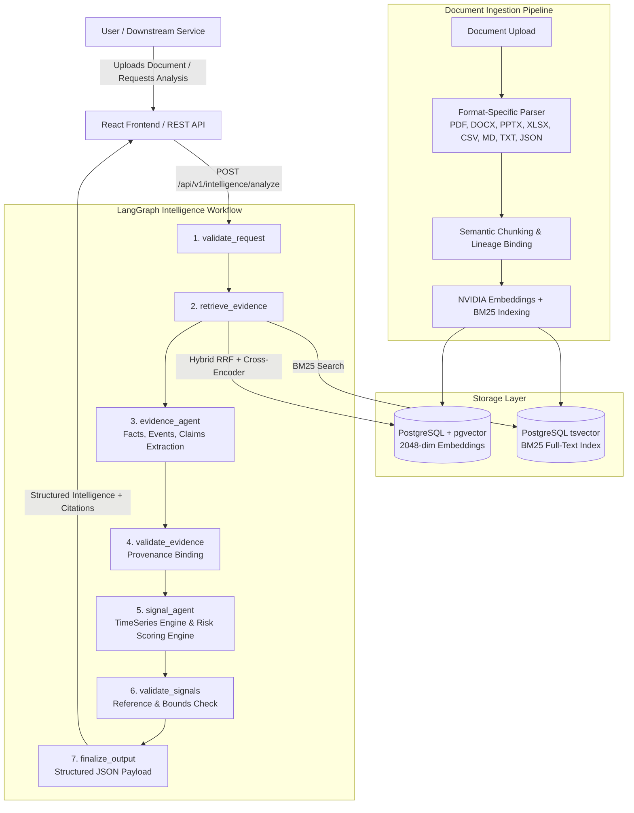

# 🚀 FailureOps Intelligence Service


An intelligent, production-grade, document-grounded intelligence and agentic RAG service for FailureOps. It visually parses complex multi-column documents (PDFs, DOCX, PPTX, XLSX, CSV, Markdown, TXT, JSON), retrieves exact evidence using hybrid strategies (Dense Vector + BM25 Lexical), reranks candidates with cross-encoders, and executes a 7-node LangGraph workflow to extract structured evidence, concrete events, qualitative claims, and chronological time-series telemetry. It normalizes signals, computes metric-aware risk scores across multiple polarities, and delivers citation-backed intelligence to power downstream operational resilience platforms.

---

## 📑 Table of Contents

- [🎯 Project Overview](#-project-overview)
- [✨ Key Features](#-key-features)
- [🏗️ High-Level Architecture](#️-high-level-architecture)
- [📄 Multi-Format Document Ingestion V2](#-multi-format-document-ingestion-v2)
- [🔬 Detailed RAG Pipeline](#-detailed-rag-pipeline)
- [🔎 Retrieval Architecture](#-retrieval-architecture)
- [🧠 Query Processing](#-query-processing)
- [🛡️ Hallucination Prevention & Grounding](#️-hallucination-prevention--grounding)
- [⚡ Agentic RAG & Performance Architecture](#-agentic-rag--performance-architecture)
- [🤖 Agentic RAG Capabilities](#-agentic-rag-capabilities)
- [📈 Performance Benchmarks](#-performance-benchmarks)
- [🤖 AI / ML Technology Stack](#-ai--ml-technology-stack)
- [🖥️ Frontend](#️-frontend)
- [🔌 Backend API](#-backend-api)
- [🗄️ Database Architecture](#️-database-architecture)
- [📁 Project Structure](#-project-structure)
- [🛠️ Setup & Installation](#️-setup--installation)
- [🧪 Evaluation](#-evaluation)
- [⚠️ Troubleshooting](#-troubleshooting)
- [🔮 Future Work](#-future-work)

---

## 🎯 Project Overview

**The Problem:** Modern engineering organizations manage complex multi-source documents—such as postmortems, architecture reviews, telemetry sheets, release plans, and customer feedback logs. Standard semantic search fails on tabular time-series data, scrambles chronological ordering across retrieved chunks, and fabricates risk scores by naively clamping arbitrary raw numbers.

**The Solution:** **FailureOps Intelligence Service** solves this through a deterministic, multi-stage LangGraph and RAG pipeline:
1. **Intelligent Processing:** Vision-Language Models (NVIDIA Nemotron Parse) and native structural parsers preserve multi-column text and tables without scrambling rows.
2. **Hybrid Retrieval:** Fuses dense vector embeddings (`pgvector`) and lexical BM25 (`tsvector`) via Reciprocal Rank Fusion (RRF).
3. **Precision Cross-Encoder Reranking:** Eliminates irrelevant candidates before evidence synthesis using a high-precision reranker.
4. **LangGraph Intelligence State Machine:** Executes a compiled 7-node workflow for request validation, evidence extraction, signal normalization, risk scoring, and structured output generation.
5. **Deterministic Time-Series Engine:** Reconstructs chronological observations across shuffled chunks, separating baseline-to-current total change from period-over-period movement.
6. **Metric-Aware Risk Scoring:** Evaluates metric polarities (`HIGHER_IS_WORSE`, `LOWER_IS_WORSE`, `TARGET_BAND`, `NEUTRAL_INFORMATIONAL`) against SLA benchmarks and domain archetypes with strict $0\text{–}100$ risk scaling ($0\text{–}30 \to \text{LOW}$, $31\text{–}60 \to \text{MED}$, $61\text{–}80 \to \text{HIGH}$, $81\text{–}100 \to \text{CRIT}$).

*Project Documents → parsing & chunking → hybrid retrieval & reranking → LangGraph workflow → evidence, events & claims → deterministic time-series → metric-aware risk scoring → structured intelligence*

---

## ✨ Key Features

### 📄 Document Intelligence
- **VLM PDF Parsing:** Visually parses complex PDF layouts, headers, and tables using NVIDIA Nemotron Parse.
- **Native Structural Office Parsers:** Parses DOCX, PPTX, XLSX, CSV, Markdown, TXT, and JSON while maintaining document hierarchy and tabular integrity.
- **Document Lineage:** Tracks the exact physical `page_id`, `block_id`, slide number, or sheet coordinate for every parsed element.

### 🧩 Document Processing
- **Semantic Chunking:** Text is sliced into structured windows respecting sentence, paragraph, and table boundaries.
- **Metadata Propagation:** Chunks inherit document titles, section headers, and temporal column headers to provide isolated retrieval context.

### 🔎 Retrieval
- **Dense Vector Retrieval (pgvector):** Captures semantic meaning (e.g., matching "service slowdown" to "latency spike").
- **BM25 Lexical Retrieval:** Uses PostgreSQL's `tsvector` to match exact system metrics, incident IDs, and microservice names.
- **Reciprocal Rank Fusion (RRF):** Merges Dense and Lexical candidate lists mathematically.
- **Cross-Encoder Reranking:** Evaluates query-chunk relevance scores using `nvidia/llama-nemotron-rerank-vl-1b-v2`.

### 🧠 Query Intelligence
- **Deterministic Scope Classification:** Classifies queries into `SINGLE_FACT`, `EXHAUSTIVE_LIST`, or `COMPARISON` to adjust retrieval candidate pools.
- **Dynamic Context Bounds:** Expands retrieval depth dynamically for comprehensive cross-document audits.

### 🛡️ Grounded Generation & Hallucination Prevention
- **Semantic Fast-Fail Gate:** Short-circuits in $<0.02\text{s}$ returning `INSUFFICIENT_EVIDENCE` if all retrieved candidates fall below the relevance threshold.
- **Strict Evidence Grounding:** LLM extraction is heavily bound to untrusted chunk boundaries, preventing prompt injection and data fabrication.

### 📊 Observability & Citations
- **Source Tracking:** Citations are bound to document names, logical page numbers, sheet names, or row ranges.
- **Deep Source Linking:** Direct browser preview for PDFs and original download streaming for tabular data and Office documents.

### ⚡ Performance Optimization
- **LangGraph StateMachine:** Predictable 7-node linear pipeline with timing-safe service authentication and multi-tenant isolation.
- **Deterministic Zero-LLM Math:** All percentage changes, baseline comparisons, and risk piecewise calculations are computed strictly in Python.

---

## 🏗️ High-Level Architecture



---

## 📄 Multi-Format Document Ingestion V2

The system supports robust parsing and ingestion across multiple document formats:

| Format | Parser | Extracted Content |
|--------|--------|-------------------|
| PDF | NVIDIA Nemotron Parse VLM + PyMuPDF | Text, tables, layout, page/block structure |
| DOCX | python-docx parser | Paragraphs, headings, tables |
| PPTX | python-pptx parser | Slides, text, titles, tables |
| XLSX | openpyxl parser | Worksheets, rows, tables |
| CSV | Python csv parser | Headers, columns, and rows |
| Markdown | Markdown parser | Headings, text, tables |
| TXT | Text parser | Paragraphs and logical sections |
| JSON | Python json parser | Structured/nested JSON telemetry |

### Ingestion Architecture
Documents are dynamically routed by file extension into the unified RAG pipeline:

```text
Upload
  ↓
Format-specific parser
  ↓
Structured DocumentBlock/Page representation
  ↓
Semantic chunking with lineage headers
  ↓
Embeddings (2048-dim) + BM25 tsvector
  ↓
Hybrid/RRF candidate retrieval
  ↓
Cross-Encoder Reranking
  ↓
LangGraph Intelligence Pipeline
```

### Format-Aware Citations
Lineage metadata securely tracks format-specific coordinates rendered in the frontend:

- **PDF** → Page number
- **PPTX** → Slide number
- **XLSX** → Sheet name
- **CSV** → Row range
- **Markdown** → Section heading
- **DOCX** → Section heading
- **TXT** → Logical line number

*Example Citations:*
```text
engineeringmetrics.csv
Rows: 1-12

grid_pulse.pdf
Page: 2

teamoperations.csv
Rows: 1-15
```

### Smart Source & Preview Behavior
Clicking a citation opens or downloads the exact source file:
- **PDF** → Opens browser PDF viewer directly.
- **DOCX / PPTX / XLSX** → Triggers original file download stream.
- **CSV / MD / TXT** → Rendered inline or downloaded with appropriate MIME type.

---

## 🔬 Detailed RAG Pipeline

### 1. Document Ingestion
- **Input:** Raw document bytes (.pdf, .docx, .pptx, .xlsx, .csv, .md, .txt, .json).
- **Technology:** FastAPI Background Tasks.
- **Why:** Non-blocking async ingestion keeps the API responsive during large corpus indexing.

### 2. Format-Aware Parsing
- **Input:** Raw file.
- **Processing:** Directs files to format-specific structural parsers (VLM for PDFs, openpyxl for XLSX, csv for CSV).
- **Technology:** NVIDIA Nemotron Parse (PDFs), python-docx, python-pptx, openpyxl.

### 3. Chunking & Metadata
- **Input:** Structured Markdown / tables.
- **Processing:** Slices text into overlapping windows while attaching parent document ID, page coordinates, and section hierarchy.

### 4. Embedding
- **Input:** Chunk text.
- **Processing:** Generates 2048-dimensional dense vector embeddings.
- **Technology:** `nvidia/llama-nemotron-embed-vl-1b-v2`

### 5. Query Analysis
- **Input:** User query or intelligence analysis request.
- **Processing:** Deterministic regex heuristic classification (`SINGLE_FACT`, `EXHAUSTIVE_LIST`, `COMPARISON`).

### 6. Hybrid Retrieval
- **Processing:** Executes parallel pgvector HNSW cosine search (Dense) and PostgreSQL BM25 `tsvector` matching.
- **Why:** Dense search catches conceptual semantics; BM25 captures exact metric names like `API_P95_MS`.

### 7. RRF & Reranking
- **Processing:** Fuses candidate ranks via Reciprocal Rank Fusion (`1 / (k + rank)`) and re-scores candidates with a Cross-Encoder.
- **Technology:** `nvidia/llama-nemotron-rerank-vl-1b-v2`

### 8. Context Slicing
- **Processing:** Deduplicates retrieved chunks by unique ID and bounds context payload to eliminate redundant overlapping lines.

### 9. LangGraph Grounded Extraction
- **Processing:** Feeds bounded evidence to the 7-node LangGraph state machine for fact, event, claim, and time-series extraction.

### 10. Citation Tracking & Provenance
- **Output:** Every generated signal, event, and claim maps to verifiable evidence items with source document name and coordinates.

---

## 🔎 Retrieval Architecture

Retrieval prioritizes raw document content using **Hybrid Search**:
1. **Dense Retrieval:** 2048-dimensional vectors stored in PostgreSQL using `pgvector`. Cosine similarity quickly identifies semantically relevant passages.
2. **Lexical Retrieval:** PostgreSQL native `tsvector` and `plainto_tsquery` execute BM25 full-text matching for exact metric names and identifiers.
3. **Fusion (RRF):** Mathematical Reciprocal Rank Fusion (`1 / (k + rank)`) combines dense and lexical results.
4. **Reranking:** Fused candidates are evaluated by a Cross-Encoder to generate a relevance logit score.

**Example:**
*Query: "What is the P95 API latency and recent error rate degradation across core microservices?"*
- Dense Retrieval captures semantic meaning (e.g., "slow endpoint response", "degraded throughput").
- Lexical Retrieval matches exact metric keys (e.g., `API_P95_MS`, `ERROR_RATE`).
- Reranking scores which chunks contain verified numerical observations and temporal dates.

---

## 🧠 Query Processing

The system employs **Deterministic Heuristic Analysis**:
- The `query_understanding.py` module evaluates intent patterns.
- Queries requesting broad audits or comprehensive inventories are assigned `EXHAUSTIVE_LIST` scope, dynamically increasing retrieval candidate caps.
- Targeted metric lookups utilize bounded candidate windows to ensure sub-second retrieval.

---

## 🛡️ Hallucination Prevention & Grounding

The system enforces strict anti-hallucination barriers:
1. **Semantic Fast-Fail Gate:** If all retrieved candidates score below the reranker threshold (`< -8.5`), the pipeline returns `INSUFFICIENT_EVIDENCE` in $<0.02\text{s}$ without invoking generation models.
2. **Untrusted Chunk Isolation:** EvidenceAgent prompt boundaries strictly delimit untrusted user document text to prevent prompt injection.
3. **Strict Zero-LLM Math:** All percentage changes and risk scores are calculated deterministically in Python.

---

## ⚡ Agentic RAG & Performance Architecture

**Hybrid Agentic Architecture:**
- **Fast Path:** Direct question-answering lookups flow deterministically from retrieval to generation.
- **Agentic Loop:** Multi-hop investigative queries execute bounded iterative evidence gathering (`max_iterations = 3`).
- **Tabular Deduplication:** Exact-string duplicate rows across overlapping chunks are filtered globally.
- **Multi-Key LLM API Management:** Dynamic `LLMKeyManager` rotates across multiple API keys (`NVIDIA_LLM_API_KEY_1`, `NVIDIA_LLM_API_KEY_2`) with automatic cooldowns on rate limits (`429`).

---

## 🤖 Agentic RAG Capabilities

### 1. Multi-Hop Evidence Gathering
Evaluates accumulated evidence, formulates targeted sub-queries for missing operational data, and combines new evidence with historical state.

### 2. Constraint-Aware Telemetry Filtering
Intersects multiple conditions (e.g., *"Which services exhibited P95 latency > 300ms during the deployment on 2026-08-15?"*) to discard partial candidate matches.

### 3. Exhaustive Telemetry Audits
Expands candidate pools (`top_k = 300`) and deduplicates tabular rows for full workspace metric rollups.

### 4. Fast Path Routing
Direct single-fact lookups bypass iterative overhead for minimal latency.

### 5. Multi-Key API Rotation
Distributes inference load across NVIDIA API keys with automatic failover and retry logic.

### 6. Observability
Exposes pipeline diagnostics, execution iterations, stop reasons, and per-node latencies directly in the UI.

---

## 📈 Performance Benchmarks

*Measured on the internal evaluation suite against a live backend (`tests/eval_suite.py`). Absolute latency depends on upstream NVIDIA API network conditions.*

| Query Type | Previous Architecture Latency | Current Fast-Path Latency | Context Size (Chars) | Result |
|---|---:|---:|---:|---|
| **Exact Metric Fact** | > 22.0s | **~10.0 - 13.0s** | ~27,000 | SUPPORTED |
| **Temporal Lookup** | > 18.0s | **~10.6s** | ~29,000 | SUPPORTED |
| **Exhaustive List** | > 29.0s | **~29.0s** | ~74,000 | SUPPORTED |
| **Out-of-Domain** | > 18.0s | **< 0.02s** (Fast-Fail) | 0 | INSUFFICIENT |

---

## 🤖 AI / ML Technology Stack

| Component | Technology / Model | Purpose |
|---|---|---|
| **Frontend Framework** | React 19 / Vite / TypeScript | User Interface & Observability |
| **Backend Framework** | FastAPI / Uvicorn | API Server & Worker Orchestration |
| **Database** | PostgreSQL 16 / pgvector | Relational Storage, Vector Search & BM25 |
| **Workflow Orchestration** | LangGraph / LangChain Core | 7-Node StateGraph Intelligence Pipeline |
| **PDF Visual Parser** | `nvidia/nemotron-parse` | Layout and Table Understanding |
| **Document Parsers** | `python-docx`, `python-pptx`, `openpyxl` | Office & Tabular File Ingestion |
| **Embedding Model** | `nvidia/llama-nemotron-embed-vl-1b-v2` | 2048-dim Dense Vector Embeddings |
| **Reranker Model** | `nvidia/llama-nemotron-rerank-vl-1b-v2` | Cross-Encoder Candidate Reranking |
| **Generation LLM** | `nvidia/nemotron-3-super-120b-a12b` | Grounded Answer & Fact Extraction |
| **Risk Scoring Engine** | Python / Deterministic | Metric-Aware Polarity & Domain Archetype Scoring |
| **Time-Series Engine** | Python / Deterministic | Chronological Table & Metric Delta Extraction |

---

## 🖥️ Frontend

Built with **React 19, TypeScript, Vite, Tailwind CSS, and Lucide Icons**.

**Capabilities:**
- **Document Library:** File upload with asynchronous progress polling (`PENDING`, `PROCESSING`, `COMPLETED`, `FAILED`) and one-click deletion.
- **Chat Interface:** Interactive conversational question-answering with citation badges and markdown table rendering.
- **Intelligence View:**
  - **Signals Section:** Displays canonical metric signals, polarity badges, scoring method (`[DOMAIN ARCHETYPE]`, `[EXPLICIT SLA]`, `[BASELINE RELATIVE DELTA]`, `[NEUTRAL TELEMETRY]`), risk score ($0\text{–}100$), score-based severity (`LOW`, `MEDIUM`, `HIGH`, `CRITICAL`), and mathematical explanations.
  - **Raw Telemetry vs. Risk Score Separation:** Displays raw current, baseline, and previous values alongside both Total Baseline Change ($\Delta_{\text{base}}$) and Period Change ($\Delta_{\text{prev}}$).
  - **Evidence Items:** Verified numerical and textual facts with confidence scores and source citations.
  - **Events & Claims:** Discrete timeline events and stakeholder assertions with source document provenance and direct download links.
  - **Pipeline Diagnostics:** Expandable execution traces with per-node execution latencies.

---

## 🔌 Backend API

Built on **FastAPI** leveraging async execution.

| Endpoint | Method | Purpose |
|----------|--------|---------|
| `/api/v1/documents/upload` | `POST` | Ingests documents (.pdf, .docx, .pptx, .xlsx, .csv, .md, .txt, .json) |
| `/api/v1/documents/` | `GET` | Lists all documents, processing statuses, and chunk counts |
| `/api/v1/documents/{id}/download` | `GET` | Streams the original file bytes with dynamic MIME types |
| `/api/v1/documents/{id}` | `DELETE` | Cascades deletion across document chunks and vector embeddings |
| `/api/v1/chat/` | `POST` | Conversational RAG endpoint (accepts query, returns citation-backed answer) |
| `/api/v1/intelligence/analyze` | `POST` | Executes the 7-node LangGraph Intelligence Service pipeline |

---

## 🗄️ Database Architecture

We use **PostgreSQL 15+** equipped with the **`pgvector`** extension.

**`documents` Table:**
- Tracks `id`, `filename`, `status`, and administrative metadata.
- One-to-many relationship with `chunks` and `pages`.

**`chunks` Table:**
- `document_id` (FK)
- `content` (Text: parsed text or markdown table chunk)
- `lineage` (JSONB: stores `page_ids`, `block_ids`, sheet names, or row ranges)
- `headers` (JSONB: document structure hierarchy)
- `embedding` (`vector(2048)`: pgvector column for cosine similarity)
- PostgreSQL `tsvector` indexes cover `content` for lexical BM25 matching.

---

## 📁 Project Structure

```text
langgraph-rag/
├── app/
│   ├── api/                 # FastAPI routes (chat, documents, health)
│   ├── core/                # ENV Configuration, logging
│   ├── db/                  # SQLAlchemy models and database session
│   ├── intelligence/        # FailureOps LangGraph Intelligence Service
│   │   ├── agents/          # EvidenceAgent, SignalAgent
│   │   ├── api/             # Intelligence routes (/analyze)
│   │   ├── graph/           # StateGraph definition and 7 workflow nodes
│   │   │   └── nodes/       # validation, retrieval, evidence, signal, output nodes
│   │   ├── rag/             # RAG adapter
│   │   ├── schemas/         # Pydantic schemas (Evidence, Events, Claims, Signals)
│   │   └── services/        # RiskScoringEngine, TimeSeriesEngine, Security
│   ├── models/              # SQLAlchemy database models (Document, Chunk, Chat)
│   └── services/            # Retrieval, Chunking, Query Analysis, LLM bindings
│       ├── docx_parser.py
│       ├── pptx_parser.py
│       ├── xlsx_parser.py
│       ├── csv_parser.py
│       ├── markdown_parser.py
│       ├── txt_parser.py
│       └── json_parser.py
├── docker/                  # Docker initialization SQL scripts
├── docs/                    # Architecture, evaluation, and phase documentation
├── frontend/                # React 19 / TypeScript / Vite frontend
├── storage/                 # Document storage directories (.gitkeep anchored)
├── tests/                   # Test suite
│   ├── intelligence/        # 74 automated LangGraph & Intelligence tests
│   └── eval_suite.py        # Headless RAG evaluation runner
├── .env.example             # Configuration template
├── docker-compose.yml       # Infrastructure orchestration (PostgreSQL + pgvector)
├── requirements.txt         # Python dependencies
└── README.md                # Project Documentation
```

---

## 🛠️ Setup & Installation

### 1. Prerequisites
- **Python 3.10+**
- **Node.js 18+**
- **Docker Desktop** (Required for PostgreSQL + `pgvector`)
- **Git**

### 2. Clone the Repository
```bash
git clone https://github.com/Princewinston/langgraph-rag.git
cd langgraph-rag
```

### 3. Start the Database (Docker)
Starts PostgreSQL + `pgvector` locally on port 5435:
```bash
docker-compose up -d
```

### 4. Backend Environment & Dependencies
```bash
# Create Virtual Environment (Windows)
python -m venv .venv
.\.venv\Scripts\activate

# Install Dependencies
pip install -r requirements.txt
```

### 5. Environment Variables
```bash
copy .env.example .env
```
Configure required keys in `.env`:
- `NVIDIA_API_KEY`: Key for AI Services (Embeddings, Reranking, VLM Parsing).
- `NVIDIA_LLM_API_KEY_1`: Primary generation LLM key.
*(Do not commit `.env`!)*

### 6. Initialize Database
Create tables and vector indexes:
```bash
python -m app.db.init_db
```

### 7. Start Backend
```bash
python -m uvicorn app.main:app --host 127.0.0.1 --port 8000 --reload
```

### 8. Start Frontend (New Terminal)
```bash
cd frontend
npm install
npm run dev
```
Open **`http://localhost:5173`** in your browser.

---

## 🧪 Evaluation

The repository includes comprehensive automated test suites to verify LangGraph orchestration, metric-aware risk scoring, time-series calculations, and RAG retrieval accuracy deterministically.

**Run the Intelligence test suite (74 tests):**
```bash
pytest tests/intelligence/ -v
```

**Run the headless RAG evaluation suite:**
```bash
$env:PYTHONUNBUFFERED=1; python tests/eval_suite.py
```

**What it tests:**
- 7-node LangGraph workflow execution and node transitions
- Metric-aware risk scoring (Polarities, SLA benchmarks, Domain archetypes, Baseline-relative trajectories)
- Grounded Event and Claim extraction with full document provenance
- Deterministic Time-Series extraction and baseline/period change separation
- Strict refusal for missing evidence (Hallucination prevention)
- Out-of-domain fast-fail latency
- Multi-format ingestion (.docx, .pptx, .xlsx, .csv, .md, .txt, .json) and structural integrity
- Cross-document retrieval across different file formats
- Document deletion cascade isolation for non-PDF deleted formats
- Existing PDF RAG behavior intact (Regression tests passed)

---

## ⚠️ Troubleshooting

- **`psycopg2.OperationalError` (Backend Crash):** PostgreSQL container is not running. Ensure `docker-compose up -d` was executed and Docker Desktop is running.
- **Frontend says `Failed to fetch`:** The React frontend cannot reach the FastAPI backend. Ensure the backend is running on `http://127.0.0.1:8000`.
- **`MODEL_TIMEOUT` or `429 Too Many Requests`:** NVIDIA API rate limits exceeded. Configure secondary keys in `.env` (`NVIDIA_LLM_API_KEY_2`) for automatic rotation.
- **Upload stays in `PENDING`:** Check backend terminal logs for parser errors or missing dependencies.

---

## 🔮 Future Work

### Implemented
- Hybrid Search (pgvector + BM25)
- Cross-Encoder Reranking (`nvidia/llama-nemotron-rerank-vl-1b-v2`)
- Out-of-Domain Fast-Fail Gate
- Context Slicing & Deduplication
- LangGraph 7-Node StateGraph Intelligence Pipeline
- Metric-Aware Risk Scoring Model & Domain Archetype Registry
- Generic Event & Claim Extraction with Complete Source Provenance
- Deterministic Multi-Point Time-Series Engine

### Future Enhancements
- **Truth Engine & Downstream FailureOps Integration (Planned):** Downstream FailureOps truth reconciliation, Failure DNA, and Failure Chain engines will consume the structured evidence, events, and claims generated by this upstream LangGraph Intelligence pipeline. The current Intelligence layer provides the verified, grounded evidence foundation for these future capabilities.
- **Automatic Queryless Analysis (Planned):** Scheduled background document ingestion triggers across full workspace corpora without requiring an explicit user query.
- **GraphRAG Support:** Extract local knowledge graphs from documents for deeper multi-hop entity reasoning.
- **Web Search Integration:** Allow the system to dynamically break out to web searches when local document evidence is explicitly insufficient.
- **Streaming UI:** Implement Server-Sent Events (SSE) to stream generator output token-by-token to the React frontend to mask generation latency.
- **Document-Aware Chat Memory:** Expand the chat pipeline to store and rewrite conversational context against vector history.
- **Downstream FailureOps Engine Connectors:** Direct streaming integration into downstream FailureOps engines (Prediction, Simulation, Interventions, Radar).
